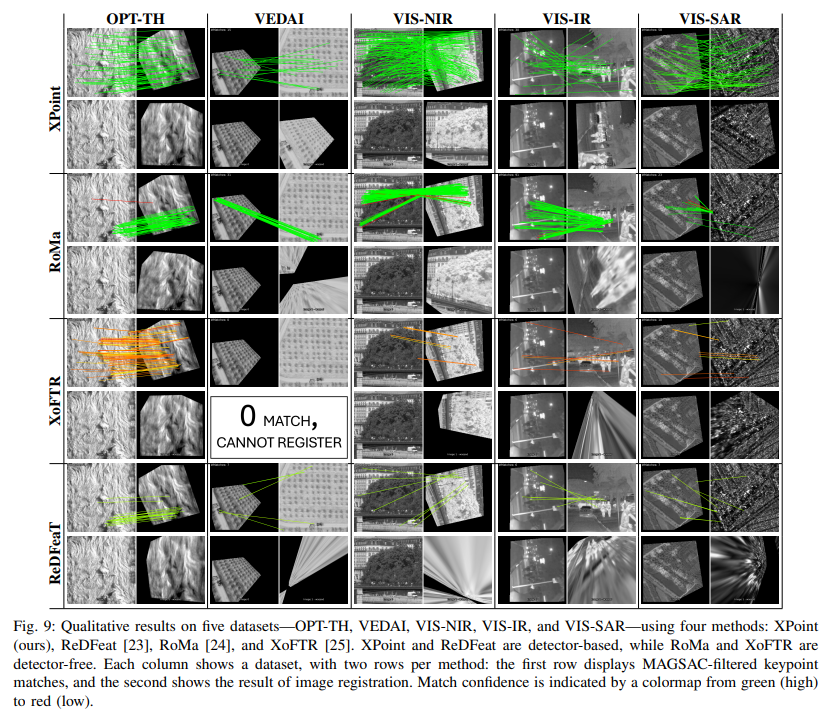

<p align="center">
  <h1 align="center"><ins>XPoint</ins> <br>A Self-Supervised Visual-State-Space based Architecture for Multimodal Image Registration</h1>
  <p align="center">
     | <a href="https://www.linkedin.com/in/icanyagmur/">İsmail Can Yağmur</a> | <br>
     | Hasan F. Ateş | <br>
     | Bahadır K. Güntürk |

  </p>
  <h2 align="center">
    <!-- <p>ECCV 2024</p>
    TODO: Add paper link -->
  </h2>
  
</p>
<p align="center">
    </a>
    <br>
    <em>Accurate multimodal image matching presents significant challenges due to non-linear intensity variations across spectral modalities, extreme viewpoint changes, and the scarcity of labeled datasets. Current state-of-the-art methods are typically specialized for a single spectral difference, such as visible-infrared, and struggle to adapt to other modalities due to their reliance on expensive supervision, such as depth maps or camera poses. To address the need for rapid adaptation across modalities, we introduce XPoint, a self-supervised, modular image-matching framework designed for adaptive training and fine-tuning on aligned multimodal datasets, allowing users to customize key components based on their specific tasks. XPoint leverages modularity and self-supervision to allow for the adjustment of elements such as the base detector, which generates pseudo-ground truth keypoints invariant to viewpoint and spectrum variations. The framework integrates a VMamba encoder, pre-trained on segmentation tasks, for robust feature extraction, and includes three joint decoder heads: two dedicated to interest point and descriptor extraction, and a task-specific homography regression head that imposes geometric constraints for superior performance in tasks like image registration. This flexible architecture enables quick adaptation to a wide range of modalities, demonstrated by training on Optical-Thermal data and fine-tuning on settings such as visual-near infrared(0.75–1.4 $\mu$m), visual-infrared(3-8 $\mu$m), visual-longwave infrared(0.8–15 $\mu$m), and visual-synthetic aperture radar. Experimental results show that XPoint consistently outperforms or matches state-of-the-art methods in feature matching and image registration tasks across five distinct multispectral datasets. </em>
</p>

##

# XPoint
This is a PyTorch implementation of "XPoint: A Self-Supervised Visual-State-Space based Architecture for Multimodal Image Registration"

## Installation
This software requires Python 3.8 or higher (Tested on 3.11.0).

Requirements can be installed with:
```
pip install -r requirements.txt
```

The repository includes pre-trained models for XPoint. However, to train the models, you need to download the dataset separately (see [Dataset](#dataset)).

<!-- The "csregnet" python package can be locally installed by executing:
```
pip install -e . --user
```
(You can remove the `--user` flag if operating in a virtual environment) -->

## Dataset
### Multispectral Image Pair Dataset
The dataset is hosted on the [Autonomous Systems Lab dataset website](https://projects.asl.ethz.ch/datasets/doku.php?id=corl2020-multipoint), which also offers basic information about the data.

The dataset can be downloaded by running (from the xpoint directory):
```python
python download_multipoint_data.py
```
A different target directory can be specified with the `-d` flag.
You can force overwrite existing files by setting the -f flag. Please note that the dataset files are quite large (over 36 GB total), so the download process may take some time.

### VEDAI Dataset
The VEDAI dataset can be downloaded from the [official website](https://downloads.greyc.fr/vedai/). The dataset is used for the evaluation of the XPoint on the VEDAI dataset.

### VIS-NIR, VIS-IR and VIS-SAR Datasets

## Dataset Structure
The dataset is expected to be structured as one of the following examples:
### 1- HDF5 Files (set "filename" parameter in config files):
```
data
├── MULTIPOINT
│   ├── training.hdf5
│   └── test.hdf5
└── VEDAI
    ├── training.hdf5
    └── test.hdf5
```
### 2- Image Files (set "foldername" parameter in config files):
```
data
├── MULTIPOINT
│   ├── training
│   │   ├── optical
│   │   │   ├── 0001.png
│   │   │   ├── 0002.png
│   │   │   └── ...
│   │   └── thermal
│   │       ├── 0001.png
│   │       ├── 0002.png
│   │       └── ...
│   └── test
│       ├── optical
│       │   ├── 0001.png
│       │   ├── 0002.png
│       │   └── ...
│       └── thermal
│           ├── 0001.png
│           ├── 0002.png
│           └── ...
```
As it can be seen, the dataset is expected to be structured in a way that the training and test data are separated into different directories. The optical and thermal images are expected to be in separate directories. The image pairs are expected to have the same name in the optical and thermal directories.


## Pre-trained Models
Pre-trained models for XPoint can be downloaded from the [drive link](https://drive.google.com/drive/folders/1M0XXW1CwirXXtgFJDc7day3YWQi-X2Ot?usp=sharing). The pre-trained models are under "ALL_BESTS" folder and include "MP","VEDAI", "NIR", "IR" and "SAR" for respective datasets models. Download those models and store them in the `model_weights` directory.

The base model is "MP" and it is trained on the multispectral image pair dataset with a resolution of 256x256. Then, other models are finetuned on their respective datasets from the base model.

<!-- ### Ground truth keypoints file
The ground truth keypoints file for the multispectral image pair dataset can be downloaded from the same link [drive link](https://drive.google.com/drive/folders/1M0XXW1CwirXXtgFJDc7day3YWQi-X2Ot?usp=sharing) under "xpoint_labels" folder.The ground truth keypoints file can be used to train your own model. -->

## Usage
In the following section the scripts to train and visualize the results of XPoint are explained. For each script, additional help on the input paramaters and flags can be found using the `-h` flag (e.g. `python show_keypoints.py -h`).


#### Benchmark on Predicting Keypoints and Homography
The performance of the trained XPoint can be evaluated by executing the `benchmark.py` script.

Example benchmark on multipoint's dataset:
```
python benchmark.py -y configs/cipdp.yaml -m model_weights/ALL_BESTS -v MP -e -p
```


Here the '-y' flag specifies yaml file ,the `-m` flag specifies the model weights, the `-v` flag the version of the model, the `-e` flag computes the metrics for the whole dataset, and the `-p` flag plots the results of some samples. The yaml file specifies the dataset and the model parameters.

#### Individually Predicting Repeatibility Score
Predicting only keypoints can be done executing the `predict_keypoints.py` script.
The results are plotted by adding the `-p` flags and the metrics for the whole dataset are computed by adding the `-e` flag.

#### Predicting the Matching and Homography Estimation Score
Predicting the alignment of an image pair can be done using the `predict_align_image_pair.py` script.
The resulting keypoints and matches can be visualized by adding the `-p` flag.
The metrics over the full dataset are computed when adding the `-e` flag.

#### Generating Keypoint Labels
Keypoint labels for a given set of image pairs can be generated using:

```
python export_keypoints.py -o tmp/labels.hdf5 -m model_weights/RIFT2 -v none
```

where the `-o` flag defines the output filename. The base detector and the export settings can be modified by making a copy of the `configs/config_export_keypoints.yaml` config file, editing the desired parameters, and specifying your new config file with the `-y` flag. `-m` flag specifies the model weights, and the `-v` flag specifies the version of the model.
```
python export_keypoints.py -y configs/custom_export_keypoints.yaml -o tmp/labels.hdf5
```


#### Visualizing Keypoint Labels
The generated keypoint labels can be inspected by executing the `show_keypoints.py` script:

```
python show_keypoints.py -d data/MULTIPOINT/training.hdf5 -k tmp/labels.hdf5 -n 100
```

The `-d` flag specifies the dataset file, the `-k` flag the labels file, and the `-n` flag the index of the sample which is shown.


#### Visualizing Samples from Datasets
By executing the following command:
```
python show_image_pair_sample.py -i tmp/test.hdf5 -n 100
```

the 100th image pair of the `tmp/test.hdf5` dataset is shown.

#### Training XPoint
XPoint can be trained by executing the `train.py` script. All that script requires is a path to a yaml file with the training parameters:

```
python train.py -y configs/cmt.yaml
```

The hyperparameter for the training, e.g. learning rate, model parameters, can be modified in the yaml file.


## Citing
If you use this code in your research, please consider citing the following paper:
```
TODO: Add citation
```


## Credits
TODO Add credits
